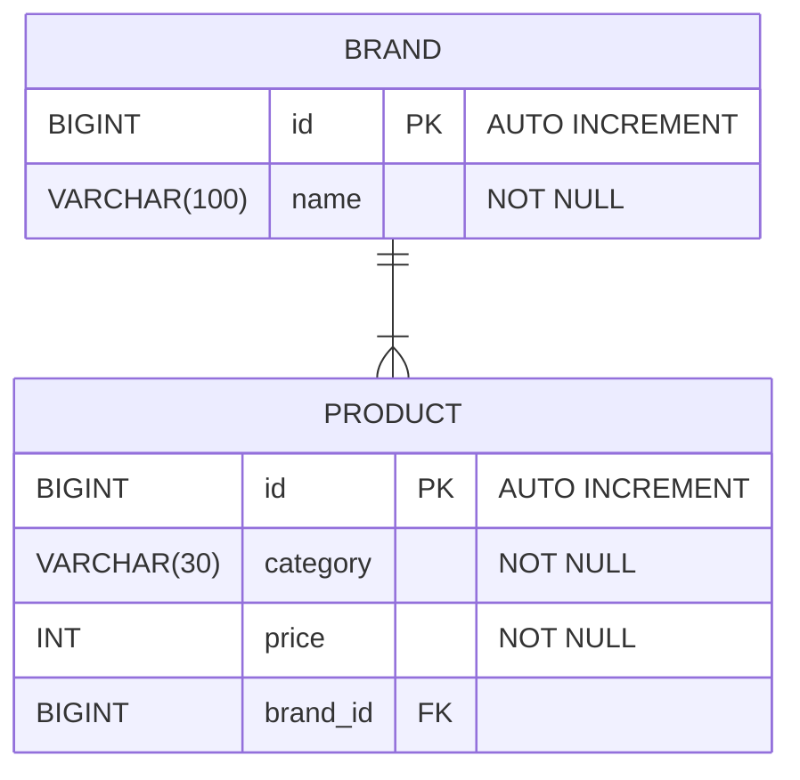

## 구현 범위

---

> 구현 1) - 카테고리 별 최저가격 브랜드와 상품 가격, 총액을 조회하는 API  
> 구현 2) - 단일 브랜드로 모든 카테고리 상품을 구매할 때 최저가격에 판매하는 브랜드와 카테고리의 상품가격, 총액을 조회하는 API  
> 구현 3) - 카테고리 이름으로 최저, 최고 가격 브랜드와 상품 가격을 조회하는 API

하위 엔드포인트를 통해 API 구현했습니다.

1. `GET /api/v1/products/categories/lowest-prices`
2. `GET /api/v1/brands/lowest-price`
3. `GET /api/v1/products/categories/{category}/lowest-highest`

* 각 API 들은 주어진 데이터에 결과값을 200 OK 상태코드와 내려줍니다.
* _Brand__, _Product__ prefix 가 붙은 controller, service, repository 클래스에 구현했으며 주어진 데이터를 활용한 test 를 작성했습니다.

> 구현 4) 브랜드 및 상품을 추가 / 업데이트 / 삭제하는 API

관리자가 사용하게 될 API 이므로 `/api/v1/admin` 으로 시작하는 API 입니다. 엔드포인트는 다음과 같습니다. (request body 와 response 는 [swagger](#swagger) 를 참고 부탁드립니다.)

* `POST /api/v1/admin/brands`
* `PATCH /api/v1/admin/brands/{id}`
* `DELETE /api/v1/admin/brands/{id}`
* `POST /api/v1/admin/products`
* `PATCH /api/v1/admin/products/{id}`
* `DELETE /api/v1/admin/products/{id}`

각 API 들은 성공과 실패 상황에 대한 응답 코드와 데이터 (메시지)를 내려줍니다.  
각 _AdminControllerTests_, _AdminServiceTests_ 클래스에 _BrandService_, _ProductService_ mocking 을 통해 테스트를 구현했습니다.

## 코드 빌드, 테스트, 실행

---

### 개발 환경

```
Language: Java 17
Framework: Springboot 3.3.4
Build: Gradle 8.10.2
Database: H2
Test: JUnit, Mockito
```

### Git Clone

```
git clone git@github.com:choi-yh/musinsa-backend-assignment.git && cd ./musinsa-backend-assignment
```

### Build & Run

```
./gradlew build    # build
./gradlew bootRun  # run

# 1,2,3번 문제에 대한 화면만 구성해놨으며, 4번 API 는 Postman 혹은 Swagger 에서 테스트 후 새로고침하여 화면에서 확인하실 수 있습니다.
open localhost:8080 # 프론트엔드 페이지
```

### Test

```
# unit tests
./gradlew clean test 
open build/reports/tests/test/index.html # 테스트 결과 확인
```

* 각 API 에 대한 테스트는 [Musinsa-backend-assignment.postman_collection.json](Musinsa-backend-assignment.postman_collection.json) 파일을 Postman 에서 Import 하거나
[Swagger](#swagger) 에서 테스트 하실 수 있습니다.  
* 제안드리고 싶은 테스트 방식은 Postman 을 Import 한 뒤, 서버 실행 후 순차적으로 Postman 으로 테스트하는 방법입니다.   
각 API 별 결과를 `localhost:8080` 페이지에서 새로고침하여 확인하실 수 있습니다.   
Postman 디렉토리 루트의 _View complete documentation_ 에 각 테스트에 대한 설명을 추가해놓았습니다.


### ERD



### Swagger

```
open http://localhost:8080/swagger-ui/index.html#/
```
